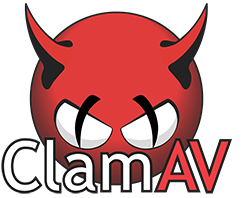
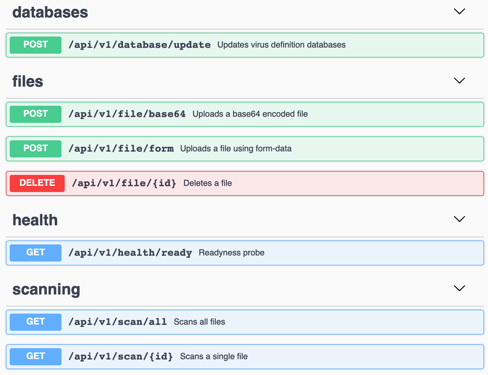

# RESTful Clam!

Containerized ClamAV antivirus with a REST API, written in Golang, with interactive Swagger UI documentation.

  - **Fast!** Uses the ClamAV daemon to run antivirus scans.
  - **Lightweight!** Image based on Alpine Linux, API written in Go.
  - **Easy!** Everything packed in a single image.

## Features

  - Supports uploads using form-data or base64 encoded strings in JSON payloads
  - Instant virus scans
  - Upload files and test the API interactively using the Swagger UI
  - Can easily be implemented as a standalone service in a microservices architecture

## Getting started
For development/testing only:
```
$ docker run -it -d --name restful-clam -p 8080:8080 sindrel/restful-clam
```
Downloading virus definition updates and starting the ClamAV daemon sometimes takes 1-2 minutes. Use the readyness probe endpoint to check if it's ready: 

```
$ curl -I -X GET "http://localhost:8080/api/v1/health/ready"
HTTP/1.1 200 OK
Date: Mon, 01 01 2019 00:00:01 GMT
Content-Length: 0
```

Test a file using command line:
```
$ curl -X POST "http://localhost:8080/api/v1/file/form?scan=true" -H  "accept: application/json" -H  "Content-Type: multipart/form-data" -F "file=@eicar.txt"
```

Example response (file infected):
```json
{
  "id": "e669053f-8125-83dd-f386-cd91b458f092",
  "sha256sum": "131f95c51cc819465fa1797f6ccacf9d494aaaff46fa3eac73ae63ffbdfd8267",
  "output": "Eicar-Test-Signature FOUND\n",
  "scanned": true,
  "infected": true
}
```

Example response (file clean):
```json
{
  "id": "e669053f-8125-83dd-f386-cd91b458f092",
  "sha256sum": "131f95c51cc819465fa1797f6ccacf9d494aaaff46fa3eac73ae63ffbdfd8267",
  "scanned": true,
  "infected": false
}
```

### Examples (Swagger)
For more examples use the interactive Swagger UI documentation:

[http://localhost:8080/swaggerui/](http://localhost:8080/swaggerui/)

Note the trailing slash ("/").




## Configuration
### Environment variables

| Variable | Example value | Description |
| ------ | ------ | ------ |
| API_CONTEXT_PATH | "/restful-clam" | Sets the API context path (default is /). |
| DATA_DIR | "/data" | Sets the base directory for file storage. |
| NO_FRESHCLAM_ON_STARTUP | 1 | Disables antivirus database updates during startup. |

### ClamAV configuration
Set your own custom ClamAV configuration by modifying the clamav/clamd.conf file.

## Development
Want to contribute? Great! 

This was originally ment as a PoC, so I'm sure you'll find something you would like to improve. Pull requests are most welcome.

## Maintainer
Sindre Lindstad

## License
GNU GPLv3 